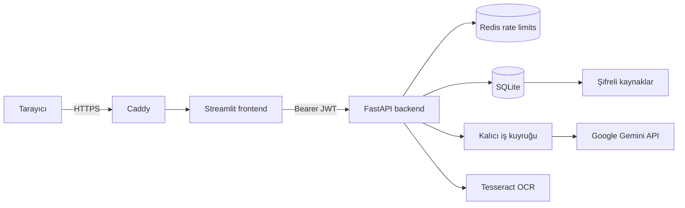

# SmartDigest

SmartDigest, Türkçe PDF ve metin belgelerini özetleyen, özet iddialarını kaynak
parçalarıyla eşleştiren ve belge üzerinden soru-cevap yapılmasını sağlayan açık
kaynak bir belge analiz uygulamasıdır.

> **Gizlilik notu:** Özetleme, kaynak kontrollü doğrulama ve belge sohbeti için
> içerik Google Gemini API'ye gönderilir. Kaynak metin, kullanıcı açıkça saklamayı
> seçmedikçe geçmiş veritabanına kaydedilmez.

## Özellikler

- PDF ve düz metin desteği
- Türkçe OCR (`Tesseract`, Türkçe ve İngilizce)
- Hızlı ve kaynak kontrollü özetleme
- Sayfa/paragraf tabanlı kaynak kanıtları
- BM25 aday bulma ve toplu NLI doğrulaması
- Belgeye dayalı soru-cevap
- Şifreli ve süreli kaynak saklama
- Kullanıcı hesabı, e-posta doğrulama ve şifre sıfırlama
- Kalıcı SQLite iş kuyruğu ve Redis tabanlı hız sınırlama
- Docker Compose, healthcheck ve Caddy HTTPS desteği

## Ekran görüntüleri

Arayüz görselleri ve güncelleme yönergeleri
[`docs/screenshots`](docs/screenshots/README.md) altında tutulur. Yeni bir arayüz
değişikliği içeren pull request, masaüstü görünümünü ve mümkünse mobil görünümü
aynı klasöre eklemelidir.

## Mimari



Backend işleri SQLite üzerinde atomik olarak sahiplenir. İş metni kuyrukta Fernet
ile şifrelenir ve terminal duruma ulaştığında silinir. Redis, production'da IP,
hesap ve global hız sınırlarını süreçler arasında paylaşır.

## Gereksinimler

- Python 3.13+
- Tesseract OCR (PDF OCR kullanılacaksa)
- Gemini API anahtarı
- Redis (production için zorunlu)
- Docker ve Docker Compose (önerilen dağıtım yöntemi)

## Yerel kurulum

```bash
git clone <repository-url>
cd SmartDigest
python3.13 -m venv .venv
source .venv/bin/activate
pip install -r requirements.txt
cp .env.example .env
```

`.env` dosyasında en az Gemini anahtarını ayarlayın:

```env
GEMINI_API_KEY=your_api_key_here
```

Backend ve frontend'i iki terminalde başlatın:

```bash
cd backend
../.venv/bin/uvicorn main:app --reload
```

```bash
.venv/bin/streamlit run frontend/app.py
```

Arayüz: <http://127.0.0.1:8501>  
API belgeleri: <http://127.0.0.1:8000/docs>

## Docker kurulumu

Geliştirme ortamı:

```bash
docker compose up -d --build
```

Production ve otomatik HTTPS:

```bash
docker compose --profile production up -d --build
```

Production profilinden önce gerçek bir alan adı, SMTP ayarları ve kalıcı gizli
anahtarlar tanımlanmalıdır. Backend ve frontend portları doğrudan internete değil,
yalnızca `127.0.0.1` adresine bağlanır; dış trafik Caddy üzerinden alınır.

## Ortam değişkenleri

| Değişken | Varsayılan | Açıklama |
|---|---|---|
| `GEMINI_API_KEY` | — | Gemini erişim anahtarı |
| `SMARTDIGEST_ENV` | `development` | `development` veya `production` |
| `SMARTDIGEST_API_URL` | `http://127.0.0.1:8000` | Frontend'in backend adresi |
| `SMARTDIGEST_DATA_DIR` | `.smartdigest-data` | DB, log ve kalıcı anahtar dizini |
| `SMARTDIGEST_FERNET_KEY` | kalıcı dosya | Kaynak şifreleme anahtarı |
| `SMARTDIGEST_JWT_SECRET` | kalıcı dosya | JWT imzalama anahtarı |
| `SMARTDIGEST_REDIS_URL` | boş | Production'da zorunlu Redis bağlantısı |
| `SMARTDIGEST_JOB_WORKERS` | `2` | Eşzamanlı özetleme worker sayısı |
| `SMARTDIGEST_JOB_QUEUE_LIMIT` | `50` | Aktif iş kuyruğu üst sınırı |
| `SMARTDIGEST_REQUIRE_EMAIL_VERIFICATION` | ortama bağlı | Yeni hesap doğrulaması |
| `SMARTDIGEST_SMTP_HOST` | boş | SMTP sunucusu |
| `SMARTDIGEST_SMTP_PORT` | `587` | SMTP portu |
| `SMARTDIGEST_SMTP_USERNAME` | boş | SMTP kullanıcı adı |
| `SMARTDIGEST_SMTP_PASSWORD` | boş | SMTP şifresi |
| `SMARTDIGEST_SMTP_FROM` | kullanıcı adı | Gönderen adresi |
| `SMARTDIGEST_PUBLIC_APP_URL` | yerel adres | E-posta bağlantılarının taban adresi |
| `SMARTDIGEST_ADMIN_EMAILS` | boş | Virgülle ayrılmış ilk yönetici e-postaları |
| `SMARTDIGEST_DOMAIN` | `localhost` | Caddy HTTPS alan adı |

Tüm seçenekler için [`.env.example`](.env.example) dosyasına bakın.

## Veri ve gizlilik modeli

- Özet geçmişi kullanıcı hesabına göre ayrılır.
- Özet her zaman saklanır; kaynak metin varsayılan olarak saklanmaz.
- Kullanıcı kaynak saklamayı seçerse metin Fernet ile şifrelenir.
- Kaynak 1, 7 veya 30 gün sonra otomatik temizlenir.
- Kuyruğa alınmış metin şifreli tutulur ve iş bitince kuyruk kaydından silinir.
- Şifreler PBKDF2-SHA256 ile salt kullanılarak hash'lenir.
- Hesap tokenları açık biçimde değil SHA-256 özetiyle saklanır.
- Özetleme ve sohbet içerikleri işlem sırasında Gemini API'ye gönderilir.

## API örneği

Kullanıcı oluşturma:

```bash
curl -X POST http://127.0.0.1:8000/auth/register \
  -H 'Content-Type: application/json' \
  -d '{"email":"user@example.com","password":"guclu-sifre"}'
```

Özetleme işi oluşturma:

```bash
curl -X POST http://127.0.0.1:8000/jobs \
  -H "Authorization: Bearer $SMARTDIGEST_TOKEN" \
  -H 'Content-Type: application/json' \
  -d '{"text":"Özetlenecek metin","mode":"verified","length":"balanced"}'
```

İş durumunu sorgulama:

```bash
curl http://127.0.0.1:8000/jobs/JOB_ID \
  -H "Authorization: Bearer $SMARTDIGEST_TOKEN"
```

Tam OpenAPI şeması `/docs` altında sunulur.

## Testler ve değerlendirme

```bash
pytest -m "not live_api and not e2e" --cov --cov-report=term-missing
ruff check backend frontend evals scripts test_extractor.py
ruff format --check backend frontend evals scripts test_extractor.py
mypy backend/models.py frontend/summary_utils.py evals/schemas.py evals/metrics.py
pip-audit -r requirements-backend.txt -r requirements-frontend.txt
```

Gerçek Tesseract testi normal test paketinde çalışır; Tesseract yoksa atlanır.
Gerçek Gemini testi yalnızca açıkça seçilir ve API kullanır:

```bash
GEMINI_API_KEY=... pytest backend/test_live_integrations.py -m live_api -q
```

Çalışan frontend'e karşı browser smoke testi:

```bash
playwright install chromium
SMARTDIGEST_E2E_URL=http://127.0.0.1:8501 pytest frontend/test_e2e.py -m e2e -q
```

CI; lint, format, tip kontrolü, en az `%60` coverage, dependency audit, Docker
build, Trivy container taraması ve Playwright smoke testini zorunlu tutar. Canlı
Gemini testi maliyet nedeniyle yalnızca manuel workflow çalıştırmasında devreye girer.

Sabit değerlendirme veri seti:

```bash
python scripts/run_evaluation.py evals/datasets/sample.json
python scripts/run_evaluation.py evals/datasets/real_turkish_pdfs.json
```

Gemini embedding ve NLI değerlendirmesi API kullanır:

```bash
python scripts/run_evaluation.py evals/datasets/real_turkish_pdfs.json --semantic
```

Ayrıntılar için [evals/README.md](evals/README.md) dosyasına bakın.

## Bilinen sınırlamalar

- Kaynak kontrollü mod otomatik bir sistemdir; hukuki, tıbbi veya finansal kararlar
  için insan doğrulamasının yerini almaz.
- Aktif Gemini HTTP isteği anında kesilemez; iptal en geç mevcut çağrı sınırında
  uygulanır.
- SQLite tek sunucu veya düşük/orta ölçek için uygundur. Yoğun yatay ölçek için
  PostgreSQL ve ayrı worker altyapısı önerilir.
- OCR doğruluğu tarama kalitesine ve Tesseract dil paketlerine bağlıdır.
- E-posta teslimatı kullanılan SMTP sağlayıcısının güvenilirliğine bağlıdır.

## Katkı

Katkılar memnuniyetle kabul edilir. Başlamadan önce
[CONTRIBUTING.md](CONTRIBUTING.md) içindeki kurulum, test, commit ve pull request
kurallarını okuyun. Güvenlik açıklarını herkese açık issue yerine
[SECURITY.md](SECURITY.md) yönergeleriyle bildirin.

## Lisans

Bu proje [MIT Lisansı](LICENSE) ile lisanslanmıştır.
